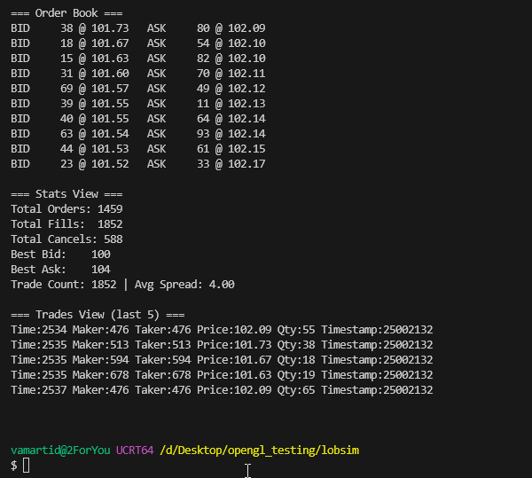

# LOBSim – *Limit Order Book Simulator*

LOBSim is a **modular Limit Order Book (LOB) Simulator** implemented in modern C++ (C++20/23).
To get an understanding of financial exchanges and high-frequency trading (HFT) systems.
It is designed as a demonstration project showcasing **low-latency systems design**, **clean architecture**, and **modern design patterns**.

---

## ✨ Features
- Full **Limit Order Book Engine** with `Price-Time Priority` matching.
- Event-driven design with a pluggable **EventBus**.
- Modular **listeners** (Market data publisher, order book views, statistics collector).
- Professional **terminal-based live views** using ANSI cursor control (todo).
- Configurable **Market Simulator** that feeds random or scripted orders.
- Extensible matching strategies via `IMatchingStrategy` interface.
- Lightweight, lock-free **data structures** for messaging.

---

## 📂 Project Structure

```
include/         # Public headers (core, engine, simulator, utils)
src/             # Implementation files
test/            # Unit tests using GTest
examples/        # Example executables (MarketSimulator demo)
utils/           # Logging, rendering, order tracking, RNG utilities
```

Key modules:
- **core/** → MarketFeeder, Order representation.  
- **engine/** → OrderBookEngine, events, matching strategies, side views.  
- **engine/events/** → EventBus, Events, Listener interface.  
- **engine/listeners/** → Pluggable listeners (StatsCollector, MarketDataPublisher, OrderBookView).  
- **engine/match/** → Matching strategy (currently Price-Time Priority).  
- **simulator/** → MarketSimulator (drives the engine with orders, runs live view).  
- **utils/** → Custom logging, RNG abstractions, order renderer/tracker.  

---

## 🧩 Architecture & Design Patterns

LOBSim emphasizes **clear separation of concerns** and **extensibility**:

### Event-Driven Core
- Central **EventBus** decouples the engine from listeners.  
- Uses **Observer pattern**: publishers (engine) broadcast `Events`, listeners (market data, stats, views) subscribe.  
- Allows plugging in new listeners (e.g., latency profiler, file logger) without modifying the engine.

### Strategy Pattern
- Matching logic encapsulated in `IMatchingStrategy`.  
- Current implementation: `PriceTimePriorityStrategy`.  
- Enables experimenting with alternative strategies when implemented (e.g., pro-rata, random tie-break).

### Side & Level Views
- `OrderBookSide` manages orders for bid/ask separately.  
- `PriceLevelView` provides aggregated level view (useful for stats & market depth).  
- Clean separation of order storage vs. representation.

### Listener Management
- The simulator registers multiple listeners to the EventBus to handle events such as order updates, fills, and market data.
- Listeners are managed automatically and unregistered when the live view or simulation stops.

### Utilities
- **Logger** with ANSI color output (in `utils/log/`).  
- **OrderRenderer/OrderTracker** provide professional-style terminal views **(Removed)**:  
  - **Market Depth View** (best bid/ask ladder).  
  - **Order Flow View** (individual order events).  
  - **Stats View** (fills, spreads, volume).  

---

## ⚡ Performance Considerations

- Designed with **low-latency** in mind (though still demo-level).  
- Custom **lock-free queues** (`SimpleMpscRingBuffer`, `spsc.h`) for event transport.  
- Minimal allocations in hot paths (orders stored in-place per side/price).  

---

## 🔧 Build System

LOBSim uses **CMake** (≥3.20) with a clear separation between include and src:

- `CMakeLists.txt` configures build options.  
  - Detects all modules in src/ and builds them as static libraries.
  - Automatically detects module dependencies by scanning includes in headers and sources.
  - Links public dependencies as PUBLIC, private ones as PRIVATE.
  - GoogleTest is integrated; tests are auto-discovered from test/*.cpp.
  - Example executables are auto-discovered from examples/*.cpp.
  - Supports Debug and Release builds with compiler flags.
  - Conditional macros allow debug instrumentation per module or test.
  - CMake generates build directories build_Debug and build_Release.
  - Use cmakeWrapper.sh to build, clean, or target specific modules.
  - Modular design ensures easy extensibility and clean architecture for the project.
- Targets are **modern CMake style** (using `target_include_directories`, `target_link_libraries`).  
- Macros:
  - **Debuging macros**
    - `ENABLE_DEBUG` → Enables debug-level logs.  
    - `ENABLE_DEBUG_ENGINE` → Enable debug-level logs for engine.  
    - `ENABLE_DEBUG_ORDERBOOKSIDE` → Enable debug-level logs for order book side.     
  - **Testing macros**
    - `PRICE_TIME_PRIORITY_DEBUG` → Enables matching to change quantity for testing.
- Unit tests under `test/` built with GTest (via CMake `FetchContent`).  
- Example executables under `examples/`.  

**Convenience scripts**:
`cmakeWrapper.sh` *Configures builds in Debug/Release mode.*
- Detect your build tool (ninja, mingw32-make, or fallback to make).
- Configure CMake build directories for Debug or Release builds.
- Build all or specific targets with parallel compilation.
- Clean build directories when needed.
- Provide colored, readable output for status messages.
```
./cmakeWrapper.sh build                 # Build Debug (all targets)
./cmakeWrapper.sh release               # Build Release (all targets)
./cmakeWrapper.sh clean                 # Remove all build dirs
./cmakeWrapper.sh cleanbuild            # Clean + Debug build
./cmakeWrapper.sh all                   # Build Debug + Release
./cmakeWrapper.sh -t OrderBookEngine_test   # Build only this Debug test
./cmakeWrapper.sh --target-release runMarketSimulator  # Build only Release executable
```

---

## 📊 Statistics & Metrics

`StatsCollector` gathers real-time statistics:
- **Trade count**  
- **Total fills**  
- **Average spread**  
- Future extensions: order-to-trade ratio, latency distributions.  

---

## 🖥️ Terminal Views (TODO)

The simulator includes multiple professional **terminal-style market views** with extensible design
1. **Market Depth Ladder** → Bids/asks with quantities at top levels.  
2. **Trade/Fill View** → Streams recent trades.  
3. **Stats Overlay** → Aggregated statistics (fills, spread).  

All views update **in-place** using ANSI cursor moves for **flicker-free refreshing**.

Controls the views with keys through MarketDataPublisher:
- Key [1] OrderBookViewRenderer
- Key [2] StatsViewRenderer
- Key [3] TradesViewRenderer

### Current view

---

## 🚀 Example Usage

Build:
```bash
./cmakeWrapper.sh build
```

Run Market Simulator:
```bash
./build_Debug/runMarketSimulator.exe
```

You’ll see a live updating market view in the terminal.  
Stop safely with `Ctrl+C`.

---

## 📚 Extending

- **Add a new matching strategy:** implement `IMatchingStrategy`.  
- **Add new views:** subclass `IEventListener`, register with EventBus.  
- **Integrate new RNGs:** implement `IRNG`.  
- **Persist data:** create a listener that logs `E_Fill`/`E_LevelAgg` events to disk.  

---

## 🎯 Why This Design?

This project is designed as a **portfolio piece** to demonstrate:  
- Practical use of **modern C++20/23** features.  
- Application of **design patterns** to real-world trading problems.  
- Experience with **low-latency systems**.  
- Clean **CMake build setup** and modular code organization.  
